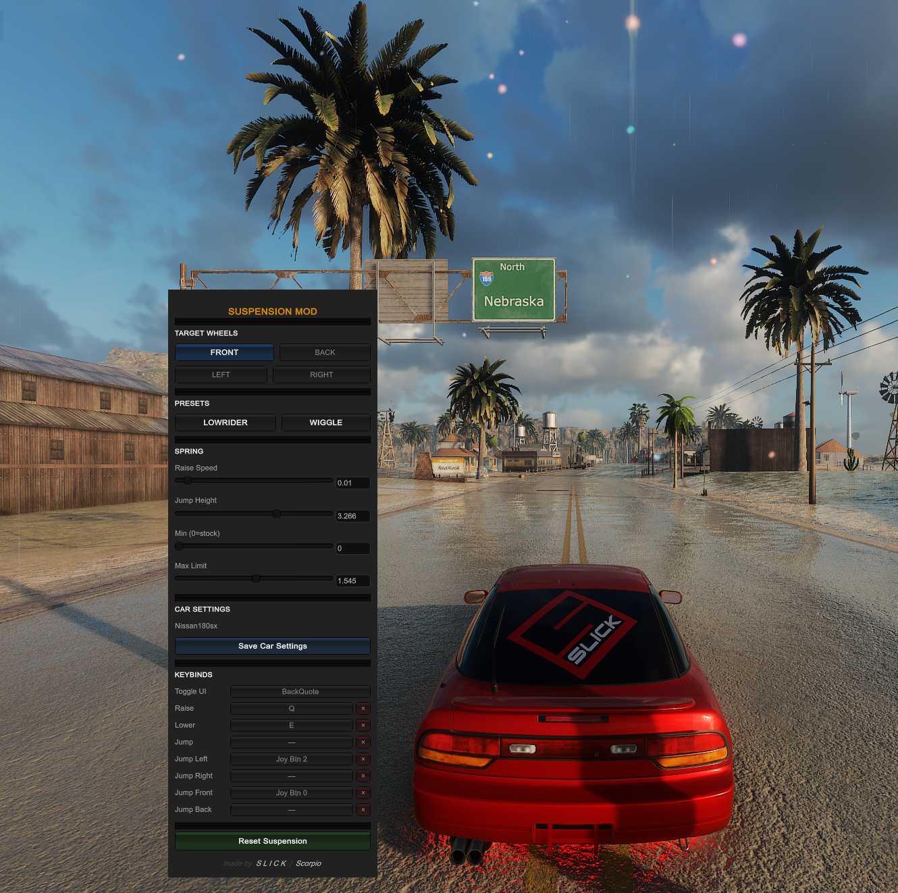
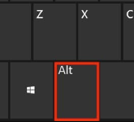

# Suspension Mod for CarX Drift Racing Online


CarX Suspension Mod that is significantly improved from the previously available mods, firstly, it doesn't crash the game, additionaly the UI is simplified and modernized. Binding the Joystick buttons and being able to save settings for each car are some of the features added to this mod. Enjoy 💯



---

## Installation

1. Download `SuspensionMod_win.zip` from [**Releases**](../../releases/latest)
2. Extract `SuspensionMod.ksm` into your `kino/mods/` folder
3. Launch the game

**Where is `kino/mods/`?**
```
C:\Program Files (x86)\Steam\steamapps\common\CarX Drift Racing Online\kino\mods\
```

---

## Controls

Press **Left Alt** to open the mod window. All keys can be rebound inside the UI.

### Default keybinds



| Action | Default | Notes |
|---|---|---|
| Toggle UI | Left Alt | Cannot be unbound |
| Raise | Q | Hold to raise targeted wheels |
| Lower | E | Hold to lower targeted wheels |
| Jump | Space | Quick hop, auto-restores |
| Jump Left | — | Optional direct-side jump |
| Jump Right | — | Optional direct-side jump |
| Jump Front | — | Optional direct-row jump |
| Jump Back | — | Optional direct-row jump |

> Controller buttons are fully supported. Click any keybind button in the UI, then press a key or controller button to rebind. Press **×** to clear a bind.

---

## Wheel Targeting

Choose which wheels to affect before using Raise / Lower or Jump.

| Selection | Wheels affected |
|---|---|
| FRONT | FL + FR |
| BACK | RL + RR |
| LEFT | FL + RL |
| RIGHT | FR + RR |
| FRONT + BACK | All 4 |
| FRONT + LEFT | FL only |
| FRONT + RIGHT | FR only |
| BACK + LEFT | RL only |
| BACK + RIGHT | RR only |

Combining a row and a column targets only the intersection (e.g. FRONT + LEFT = Front Left only).

---

## Presets


| Preset | Effect |
|---|---|
| **LOWRIDER** | Bounces front wheels between raised and stock on a ~3 s cycle |
| **WIGGLE** | Rocks all 4 wheels left-right in a fast rhythm |

Only one preset can be active at a time. Switching cars while a preset is active stops it safely.

---

## Jump

Press the Jump key for a quick suspension kick. The targeted wheels extend to the **Jump Height** value and auto-restore to stock after a short moment.

**Jump Left / Right / Front / Back** are optional keybinds that bypass the UI wheel selection and always jump that specific side or row — useful for binding to controller buttons.

---

## Spring Settings

| Setting | Description |
|---|---|
| **Raise Speed** | How much the spring changes per frame while holding Raise / Lower |
| **Jump Height** | Target spring length when Jump fires |
| **Min (0 = stock)** | Floor limit — `0` keeps the car's original stock value as the minimum |
| **Max Limit** | Ceiling for spring extension |

Adjust with the slider or type an exact value directly into the field.

---

## Save Car Settings

Click **Save Car Settings** to store the current wheel heights and spring settings for the car you're driving. Next time you load into that car, the saved heights and settings are automatically applied.

---

## Reset Suspension

The **Reset Suspension** button returns all wheels to their factory stock values and clears any saved wheel heights for the current car. Spring settings (speed, jump height, limits) are kept. Use this any time you want a clean slate.

---

## Updates

When a newer version is available, a green **Update available** banner appears at the bottom of the mod window. Click it to open the releases page.

---

## Features

- **Save Car Settings** — saves wheel heights + spring settings per car; auto-loaded on car change
- **Reset Suspension** — restores factory stock values and clears saved wheel heights; spring settings preserved
- Per-wheel targeting with row + column intersection logic
- Hold Raise / Lower for smooth continuous adjustment
- Jump with auto-restore
- Jump Left / Right / Front / Back bypass UI selection for direct side/row jumps
- Lowrider and Wiggle presets with safe car-swap detection
- Controller support — scans all 8 joystick slots (Xbox One, DirectInput, etc.)
- Rebind all keys via in-game UI; × button to clear any bind
- In-game update notifications
- Sliders + text fields for all spring values
- Settings and keybinds persist between sessions

---

## Changelog

### v1.2.8
- Mod is public again — no access restriction

### v1.2.7
- Mod temporarily locked to private access (Discord-only)

### v1.2.6
- Added **Save Car Settings** — saves your wheel heights and spring settings per car; automatically loaded next time you drive that car
- Added **Reset Suspension** (replaces "Restore Suspension") — returns wheels to factory stock and clears saved heights so the car resets cleanly; spring settings are preserved
- Fixed pressing two directional jump keybinds at once (e.g. Jump Left + Jump Front) leaving one side permanently extended

### v1.2.5
- Fixed suspension staying extended when jump key is pressed quickly more than once
- Fixed pressing two directional jump keybinds simultaneously leaving one side permanently extended

### v1.2.4
- Hotfix: version bump to trigger update notification for users on v1.2.2

### v1.2.3
- Better controller keybind support — shows a reconnect hint when no controllers are detected during capture
- Fixed jump restoring wheels to wrong height after switching cars
- Fixed raise / lower using the wrong floor after switching cars
- General suspension state stability improvements

### v1.2.2
- Added Jump Left / Right / Front / Back keybinds
- Improved controller detection — scans all 8 joystick slots (fixes Xbox One / DirectInput)
- Fixed Lowrider / Wiggle using stale values after switching cars in MP lobby
- Fixed preset restore not returning to correct stock values on some cars
- Added in-game update notification banner
- Toggle UI can no longer be unbound
- Added × button per keybind row for quick clearing
- Duplicate keybinds now auto-cleared on reassign

### v1.2.1
- Preset stability fixes
- Minor UI polish

### v1.2.0
- Added Lowrider and Wiggle presets
- Added Left / Right wheel targeting
- Redesigned UI with styled sections
- Added joystick / controller keybind support
- Jump now auto-restores after a short delay

---

## Credits

Made by **SLICK** | **Scorpio**
