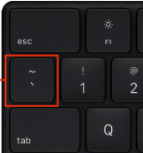
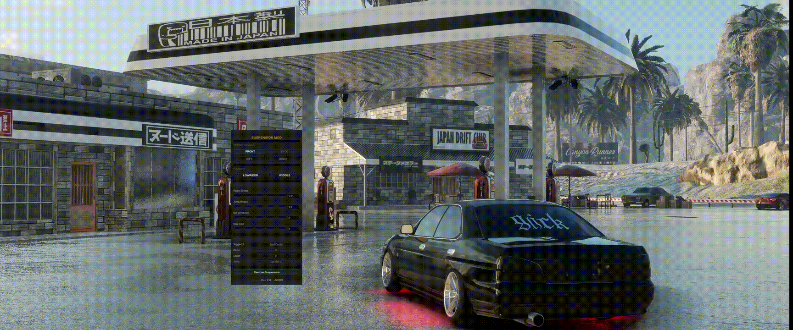
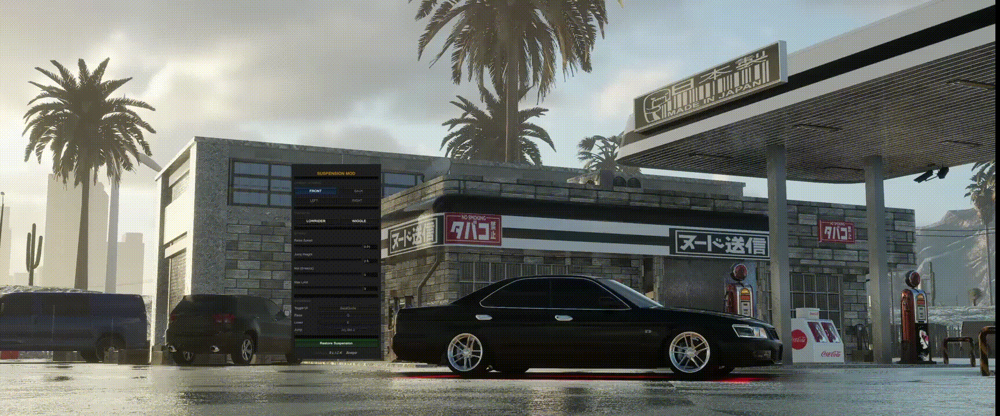

# Suspension Mod for CarX Drift Racing Online

A KSL native mod for CarX Drift Racing Online that gives you full real-time control over your car's suspension. Raise and lower individual wheels, bounce with the Lowrider preset, or rock with Wiggle — all while driving.

> [!NOTE]
> Download and install [KSL](https://github.com/trbflxr/ksl) before installing this mod.

---

## Usage

### Default keybinds

| Action | Default |
|---|---|
| Toggle UI | \` (key above Tab) |
| Raise | Q |
| Lower | E |
| Jump | Space |

Click any keybind button in the UI and press the desired key or controller button to rebind it. Controller buttons (JoyBtn 0–19) are fully supported.

---

### Opening the menu
Press **\`** (the key above Tab, left of `1`) to toggle the mod window. The key can be rebound in the **KEYBINDS** section of the UI.

---

### Wheel targeting

Select which wheels to affect before using Raise / Lower or Jump.

| Selection | Wheels affected |
|---|---|
| FRONT | Front Left + Front Right |
| BACK | Rear Left + Rear Right |
| LEFT | Front Left + Rear Left |
| RIGHT | Front Right + Rear Right |
| FRONT + LEFT | Front Left only |
| FRONT + RIGHT | Front Right only |
| BACK + LEFT | Rear Left only |
| BACK + RIGHT | Rear Right only |
| FRONT + BACK | All 4 wheels |

When both a row (Front/Back) and a column (Left/Right) are active, only the intersection is targeted. Multiple corners can be combined freely.

---

### Raise / Lower

Hold the bound key to continuously adjust the targeted wheels up or down. The **Raise Speed** setting controls how much the spring changes per frame.

---

### Jump

Press the Jump key for a quick suspension kick — the targeted wheels instantly extend to the **Jump Height** value, then auto-restore to stock after a short moment.

---

### Presets

| Preset | Effect |
|---|---|
| **LOWRIDER** | Continuously bounces front wheels between a raised position and stock (~3 s cycle) |
| **WIGGLE** | Alternates all 4 wheels left-right at a fast interval for a rolling effect |

Only one preset can be active at a time. Enabling one automatically stops the other.

---

### Spring settings

| Setting | Description |
|---|---|
| **Raise Speed** | Amount the spring changes per frame while holding Raise / Lower |
| **Jump Height** | Target spring length when Jump is triggered |
| **Min (0 = stock)** | Floor limit — `0` uses the car's original stock suspension as the minimum |
| **Max Limit** | Ceiling limit for spring extension |

All values can be adjusted via slider or by typing directly into the number field.

---

## Features

- **Per-wheel targeting** — control Front, Back, Left, Right, or combine them to target individual corners (e.g. Front + Left = FL only)
- **Raise / Lower** — hold a key to continuously raise or lower the targeted wheels
- **Jump** — instantly extend suspension for a quick hop, then auto-restore
- **Lowrider preset** — bounces front wheels between a raised position and stock (~3 s cycle)
- **Wiggle preset** — rocks all 4 wheels left-right in a rhythmic cycle
- **Restore Suspension** — one-click restore to the original stock values
- **Joystick support** — all keybinds can be mapped to controller buttons (JoyBtn 0–19)
- **Sliders + text input** — fine-tune all spring values with sliders or by typing exact values
- **Persistent settings** — all values and keybinds are saved between sessions

---

## Installation

1. Install [KSL](https://github.com/trbflxr/ksl)
2. Download the latest `SuspensionMod_win.zip` from [Releases](../../releases)
3. Extract `SuspensionMod.ksm` into your `kino/mods/` folder
4. Launch the game

---

## Credits

Made by **SLICK** | **Scorpio**
